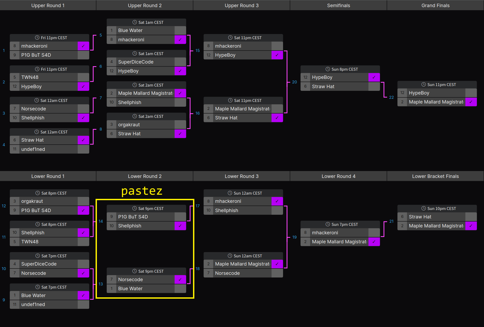

# LiveCTF Analysis - pastez

This repo contains resources for [this post](https://seeinglogic.com/posts/livectf-analysis/), an in-depth breakdown of match #13 of the DEF CON 31 LiveCTF event, where the challenge was called `pastez`.

## pastez Challenge

The easiest way to play like you were in the DEF CON 31 CTF finals: start a stopwatch and open the `handout/` folder and stop the clock when you exploit the binary and pop a shell.

If you'd rather build the challenge from scratch, check out [build_from_scratch.sh](./build_from_scratch.sh) (requires docker) which clones and builds from the [official repo](https://github.com/Live-CTF/LiveCTF-DEFCON31).
The steps are the same to build any challenge from the finals.

Best time from the competition for solving `pastez` was 15 minutes 33 seconds by [Norsecode](https://norsecode.team/).

Good luck!

## LiveCTF Streams

If you want to watch the livestreams (which contains spoilers) for the challenge, check out the links below.

Full-screen streams, no commentary: Match 13: [Blue Water](https://ctftime.org/team/205897/) vs [Norsecode](https://ctftime.org/team/110823/):
[Blue Water's screen](https://www.youtube.com/live/dthkJvZcoeM?si=8_CCNMgSykCcoXJQ&t=8545)
and [Norsecode's screen](https://www.youtube.com/live/fzxch3C1c0w?si=jMRGbHFDxwoayE0V&t=8530),
or [combined](https://viewsync.net/watch?v=fzxch3C1c0w&t=8530&v=dthkJvZcoeM&t=8545).

Live-commentated stream for Match 14: [Shellphish](https://ctftime.org/team/285/) vs [P1G But S4D](https://ctftime.org/team/268242/):
[here](https://www.youtube.com/watch?v=LDgqaQhu7ao&list=PLmnqtYqOCF7-v2bS6O6URAYAFjdKwhRj5&index=9)

My manual timestamp notes from the Match 13 streams are in [timestamps dir](./timestamps/).

They should be within 1 second of actual and gloss over some very minor details, but please feel free to reach out to me on [Twitter](https://twitter.com/seeinglogic) if you find something that seems really off.

